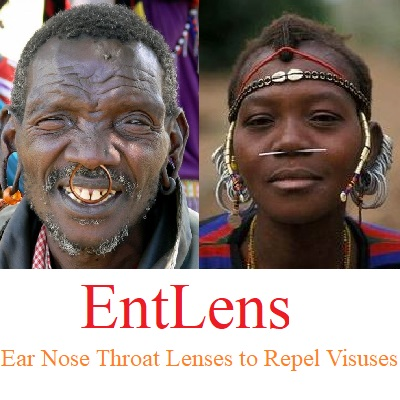

# EntLens

## Ear Nose Throat Lenses to Repel Visuses

Recent Covid-19 pandemic has prompted me to do some research on possible causes and cures of Covid-19. On Kaggle, I have discussed whether Covid-19 has some connection to White Nose Syndrome in Bats and to Malaria.

While face masks being mass popularized are great, they have some shortcomings. They can be suffocating and can make breathing difficult after a prolonged continuous use. They are not user friendly to keep always on, and may need to be removed while speaking or doing some activities. They can be in short supply when and where needed the most. The enormous recurring number of their production and disposal can pose a great threat to the environment. These shortcomings have motivated me to find an alternative to face masks.

A few years back, I had plucked out hairs from inside my nostrils. Thereafter, my allergies have increased substantially, and now I cannot live without a daily allergy tablet. This personal experience has led me to believe that hairs in nostrils and mustache on a man may be acting as a natural way of air filtration.

I have often wondered whether the custom of wearing nose rings and ear rings has some health benefits. Under the current pandemic situation, this curiosity has led me to understand relationship if any between nose ring popularity and Covid-19 incidents.

The correlation matrix in the Jupyter Notebook on this repository shows that:

- Regions where nose rings are not popular have Covid-19 deaths significantly high and as high as 1208 per million.

- Regions where nose rings are popular have Covid-19 deaths comparatively low and peaking at 677 per million.

This observation implies that nose rings may be offering some health benefits, by repelling viruses from from flowing into the respiratory tract through the nostrils.

I am now interested in designing:

- An “Ear lens” that can repel viruses from flowing into the brain through the ears.
- A “Nose lens” that can repel viruses from flowing into the respiratory tract through the nostrils.
- A “Throat lens” that can repel viruses from flowing into the respiratory tract through the throat.
